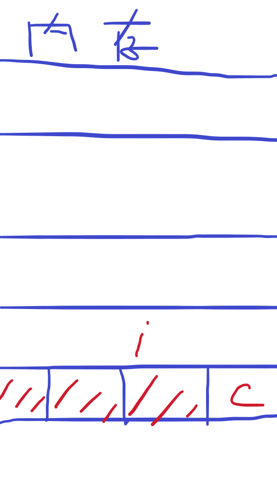
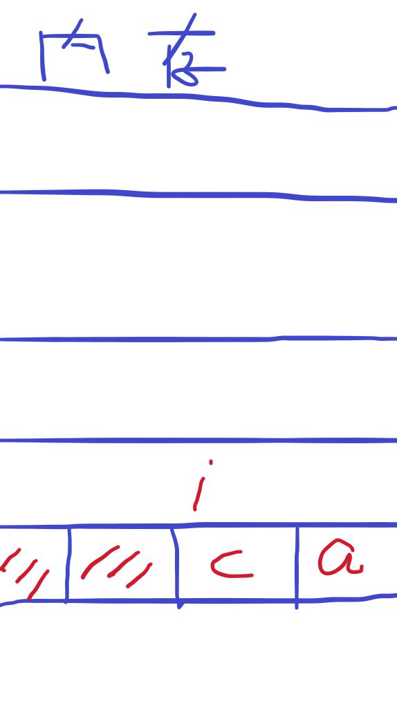
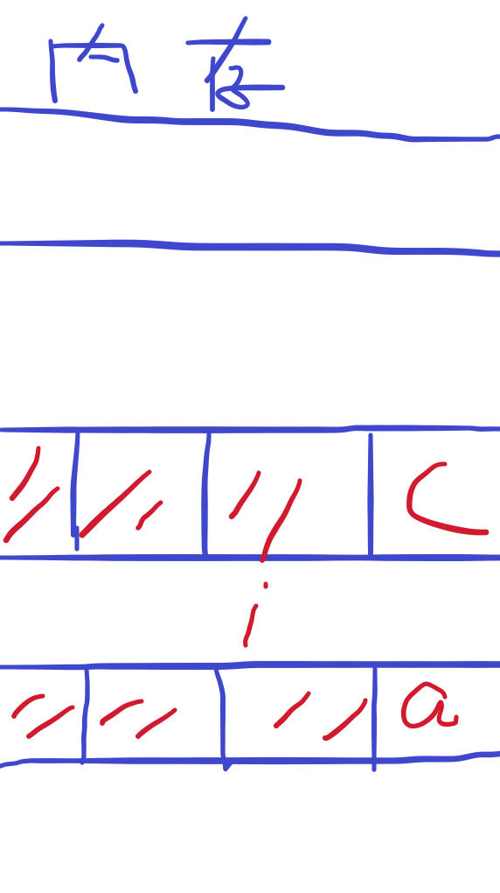
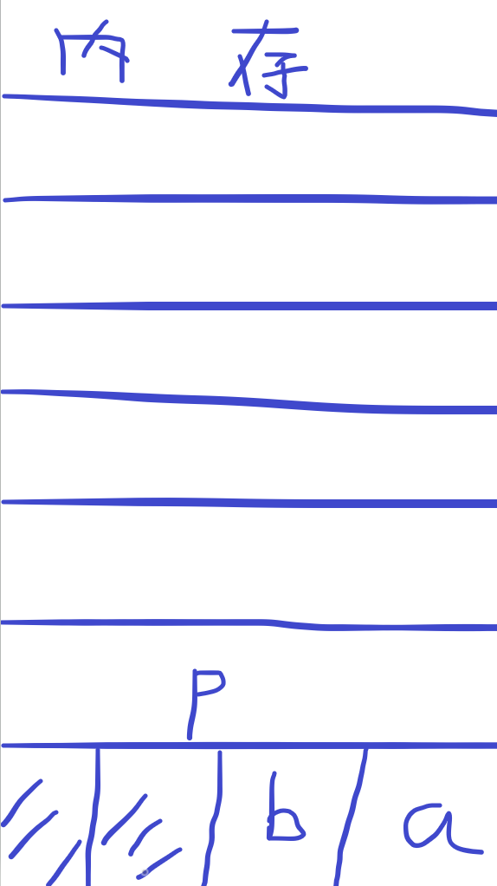
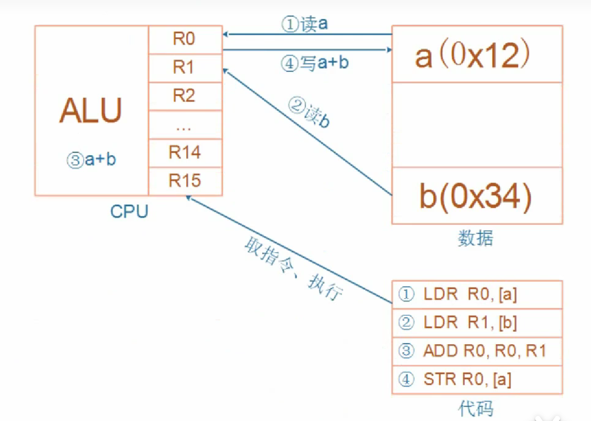
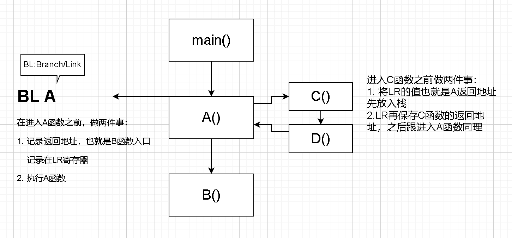
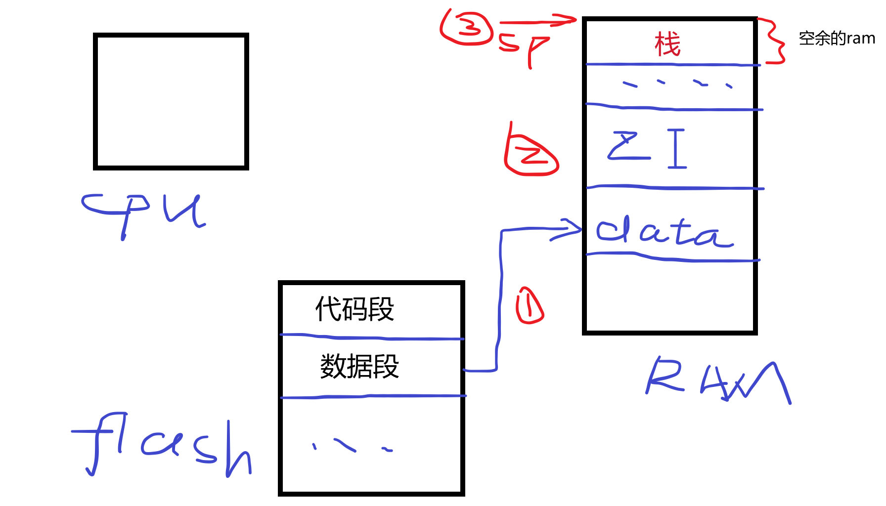
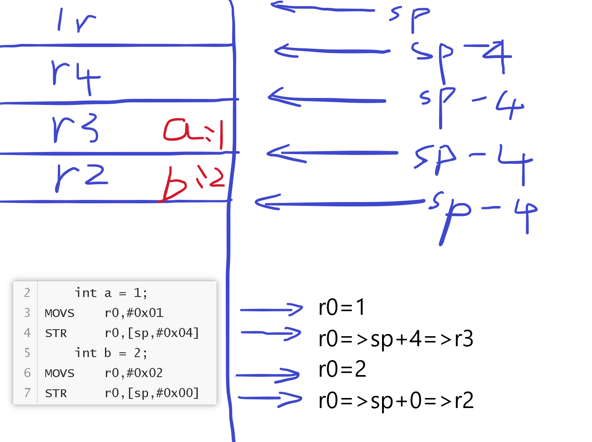

# 嵌入式C语言

### 1. 变量与指针

+ 变量，能读能写，必定在内存里
+ 指针，保存的是地址，指针变量的大小跟系统的位数有关，32位系统的指针为4Byte

### 2.关键字

##### volatile

单词意思是易变的。用这个关键字，编译器对访问该变量的代码就不再进行优化，系统总是重新从它所在的内存读取数据，即使它前面的指令刚刚从该处读取过数据，而且读取的数据立刻被保存。

在进行编译时，编译器会对代码进行优化

例如：

```C
int i=0;
for( i=0;i<100;i++ )
	...
```

在这段代码中，定义了 int 的 i ，并进行 i 的自增，对此，编译器会优化到cpu内部寄存器，在读第一次 i 的内存后，先计算完 i 才对 i 进行写内存。如果加上volatile：

```C
volatile int i=0;
```

再执行以上for循环时，i++每一步都会进行读内存、修改、写内存这些步骤，这样就导致运行速度变慢。

但是对于单片机，需要读取硬件的状态，例如GPIO的DR寄存器，就需要volatile关键字，这样才能读取到GPIO的状态。

##### const

除了修饰常量不可修改之后，还可以将这个常量放在flash，一般的变量是放在ram

##### static

全局变量的作用域是整个程序，所有文件都可以用，加上static关键字，表示这个变量只在本文件使用

##### extern

表示这个变量是其他文件定义的

### 3. 结构体

##### 结构体的定义

```C
struct student{
    char* name;
    int age;
};
```

##### 结构体的大小

eg.1

char*：4，int：4 => student：8

```C
struct student{
    char* name;
    int age;
};
```

eg.2

char name[100]：100，int：4 => student：104

```C
struct student{
    char name[100];
    int age;
};
```

eg.3

char c：1，int：4 => student：8

```C
struct student{
    char c;
    int i;
};
```

eg.4

char a：1，char c：1，int：4 => student：8

```C
struct student{
    char a;
    char c;
    int i;
};
```

eg.5

char a：1，int：4 ,char c：1=> student：12

```C
struct student{
    char a;
    int i;
    char c;
};
```

出现以上情况，是因为内存对齐，为了效率高

在32位系统，一个地址4个字节

eg.3的结构体存放情况

在存放c之后，==如果从c之后的地址，也就是奇数地址开始存放一个int的变量，在硬件访问效率上特别慢（这里的慢是奇数地址访问4个字节的变量），为了效率，不使用奇数地址==，舍弃c这块地址的另外3个字节



eg.4的结构体存放情况

这个结构体的顺序是chara->char c->int i

按顺序的存放，存放a之后还能存放c，剩余的两个字节空着，下一个地址存放i

在这里，==虽然这是两个奇数地址，但是使用奇数地址访问1个字节在效率上还是很快的，在4个字节上就很慢==



eg.5的结构体存放情况

这个结构体的成员定义顺序是char a->int i->char c

因为存放char a之后是int i，剩下的char c只能从下一个地址来存放、



### 4. 变量赋值

##### 变量赋值的例子

这是一个跟内存空间有关的赋值的代码

```C
#include <stdio.h>

char a='a';
char b='b';
int* p;

int main()
{
    printf("%p\r\n",&a);
	printf("%p\r\n",&b);
	printf("%d\r\n",a);
	printf("%d\r\n",b);
    printf("\r\n");
	p = &a;
	*p=65;
	printf("%d\r\n",a);
	printf("%d\r\n",b);
	return 0;
}
```

运行结果如下：

```
0000000000403010
0000000000403011
97
98

65
0
```

==变量a,b是全局变量，是连续存放的char类型，连续存放是重点==



如上图所示，a='a',b='b'。

在执行以下代码之后

```C
p = &a;
*p=65;
```

让一个int* 的指针指向了变量a的地址，并将其值改为65。在这一步之后，在ASCII码上，a=65，b=0

是因为指针本身是4个字节，存放a的地址，其实是存放a这一块的4个字节的地址，所以在*p=65之后，是将整个4个字节的地址赋值，就有以下结果


因此，应该==注意跨数据类型的赋值==

##### 变量赋值的底层原理

一行赋值代码究竟是如何运行的，设有以下代码：

```C
a=123;
```

大致流程是==CPU==通过执行==C语言指令==实现的

1. 程序烧录进flash
2. cpu读flash得到指令，就会执行到a=123这条指令
   1. ram上存放着a的地址，cpu得到a的地址
   2. 得到数据123
   3. 把数据写入内存

### 5. 结构体指针与函数指针

函数指针：

```C
void (*p)(void);
```

函数名就是地址，也可以加&取值

以下是结构体指针与函数指针结合的代码例子：

```C
#include <stdio.h>

typedef struct student{
	char* name;
	int age;
	void (*specialty)(void);//函数指针
	struct student *classmate;
}student,*pstudent;

void zhangsan_specialty(void)
{
	printf("program\r\n");
}

void lisi_specialty(void)
{
	printf("dance\r\n");
}

int main()
{
	int i=0;
	student class_one[2]={	{"zhangsan",18,&zhangsan_specialty,NULL},\
							{"lisi",19,lisi_specialty,NULL}     	};
	class_one[0].classmate=&class_one[1];
	class_one[1].classmate=&class_one[0];
	for(i=0;i<2;i++)
	{
		printf("name:%s age:%d classmate:%s ",\
				class_one[i].name,class_one[i].age,class_one[i].classmate->name);
		printf("specialty:");
		class_one[i].specialty();
	}
	return 0;
}
```

函数指针跟普通的指针一样，也是指针变量，存放的是函数的地址，32位系统下也是4byte。

### 6. 链表

简单实现链表：

```C
#include <stdio.h>

typedef struct node{
	int value;
	struct node *next;
}Node, *p_Node;

int main()
{
	Node A = {100,NULL};
	Node B = {101,NULL};
	Node C = {102,NULL};
	A.next = &B;
	B.next = &C;
	C.next = NULL;
	p_Node head = &A;
	while( head )
	{
		printf("val:%d\r\n",head->value);
		head = head->next;
	}
	return 0;
}
```

从功能上简单实现链表的插入和删除，未考虑其他：

```C
#include <stdio.h>

typedef struct node{
	int value;
	struct node *next;
}Node, *p_Node;

p_Node head = NULL;

//链表插入 
void Node_Insert(p_Node new_Node)
{
	p_Node last = NULL;
	if( head == NULL )
	{
		new_Node->next = NULL;
		head = new_Node;
	}
	else
	{
		last = head;
		while(last)
		{
			if(last->next==NULL)
				break;
			else
				last=last->next;
		}
		last->next = new_Node;
		new_Node->next = NULL;
	}
}

//链表删除 
void Node_Delete(p_Node old_Node)
{
	if(head==old_Node)
	{
		head=old_Node->next;
	}
	else
	{
		p_Node pre_Node=head;
		while(pre_Node)
		{
			if(pre_Node->next==old_Node)
			{
				pre_Node->next=old_Node->next;
			}
			else
			{
				pre_Node=pre_Node->next;
			}
		}
	}
}

int main()
{
	Node A = {100,NULL};
	Node B = {101,NULL};
	Node C = {102,NULL};
	Node D = {103,NULL};
	Node_Insert(&A);
	Node_Insert(&B);
	Node_Insert(&C);
	Node_Insert(&D);
	Node_Delete(&A);
	while(head)
	{
		printf("val:%d\r\n",head->value);
		head=head->next;
	}
	return 0;
}
```

### 7. ARM架构

对于以下代码的实现：

```C
int a=1;
int b=2;
a=a+b;
```

在ARM架构下是这样实现的：



CPU运行时，先去取得指令，再执行指令：

1. 把内存a的值读入CPU寄存器R0
2. 把内存b的值读入CPU寄存器R1
3. 把R0、R1累加，存入R0
4. 把R0的值写入内存a

### 8. 全局变量、局部变量的初始化和栈的引入

#####  给定初值的全局变量初始化

  + 在烧录hex文件时，是烧录进flash，程序+数据都在flash，所以给定初值的全局变量的值都在flash，因此在程序运行时，是将flash上数据段的值全部一下子复制到ram上对应变量的值上。

  + 类似memcpy，把flash上的数据段，整体拷贝到ram。

#####  初始值为0、没有初始化的全局变量的初始化  

  + 这些全局变量会放在ram上的ZI(Zero Initialize)段
  + 上电让这些全局变量全部等于0
  + 类似memset

#####  栈的引入

  如果在程序中有以下代码：

  ```C
  //伪代码
  A()
  {
      C();
      D();
  }
  
  main()
  {
      A();
      B();
  }
  ```

  在这段程序在发生以下事情：

  

  

  

##### 局部变量的初始化

```
PUSH	{r2-r4,lr}
	int a = 1;
MOVS	r0,#0x01
STR		r0,[sp,#0x04]
	int b = 2;
MOVS 	r0,#0x02
STR		r0,[sp,#0x00]
```

汇编指令PUSH，这条指令就是按顺序依次把lr、r4、r3、r2寄存器的值压入栈中


